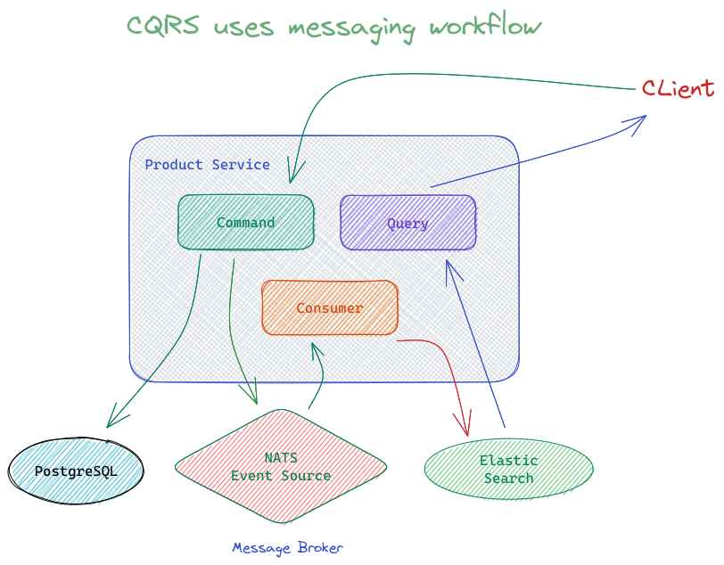

## CQRS (Command Query Responsibility Segregation) implementation in Go

- CQRS is the process of differentiating Command operations and Query operations
- Command operation is an operation to change data (Create, Update, Delete)
- Command operation is a data retrieval operation (Get, Search)
- In CQRS, usually a service or database is distinguished for Command and
query needs



## How to use

- Run the docker-compose

```bash
make up-compose
```

- Run the server

```bash
make run
```
